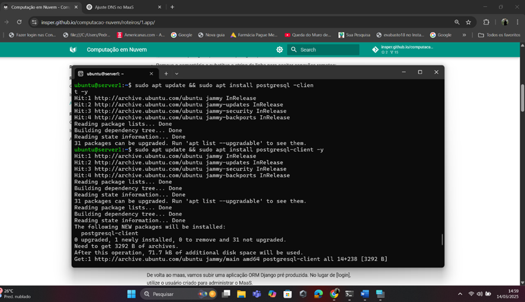
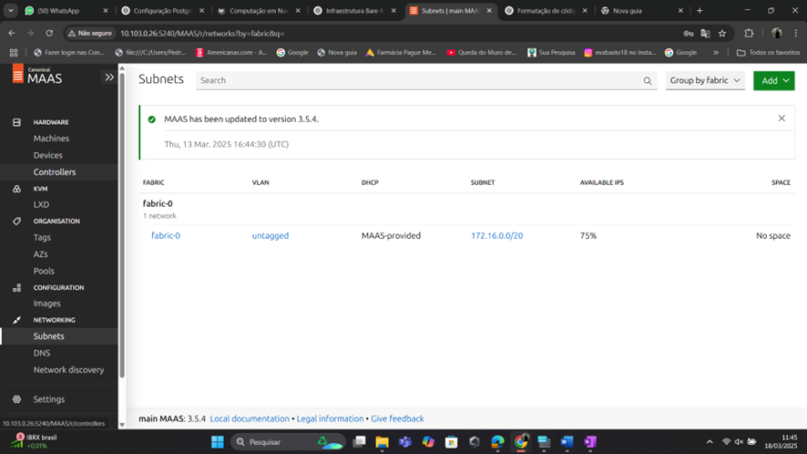
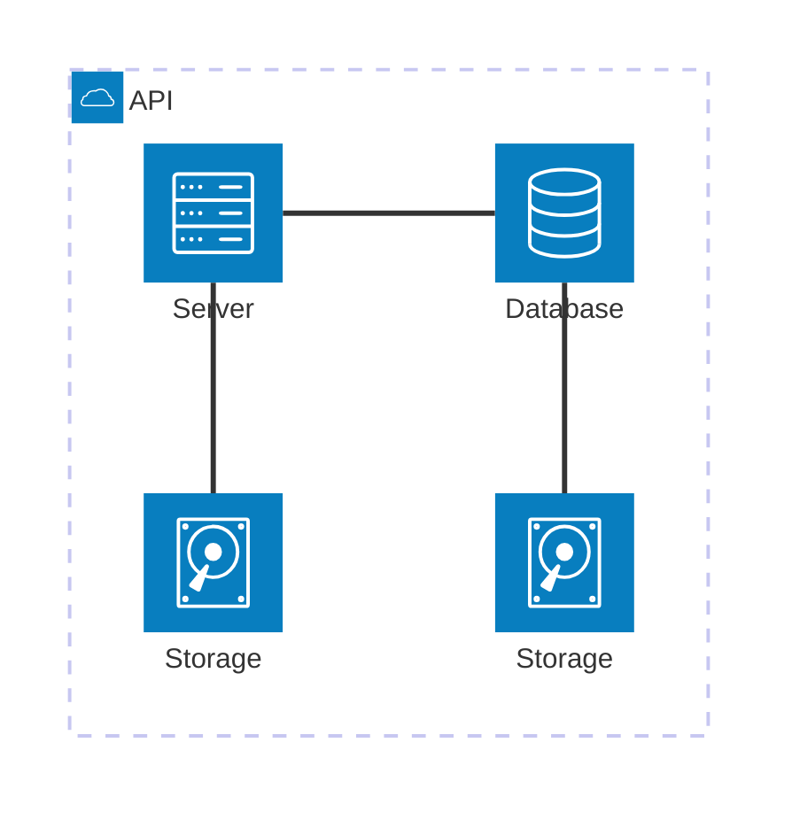
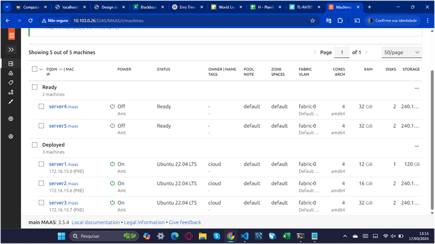
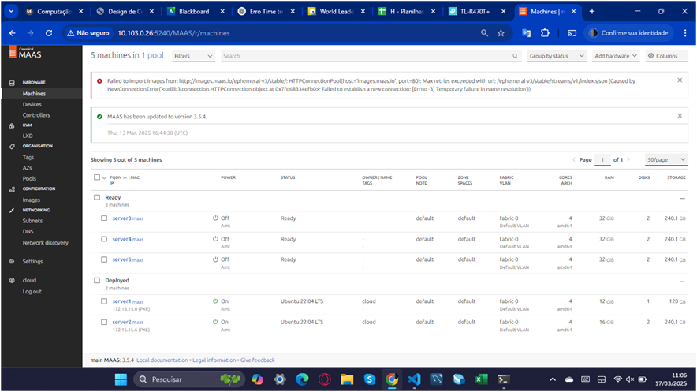
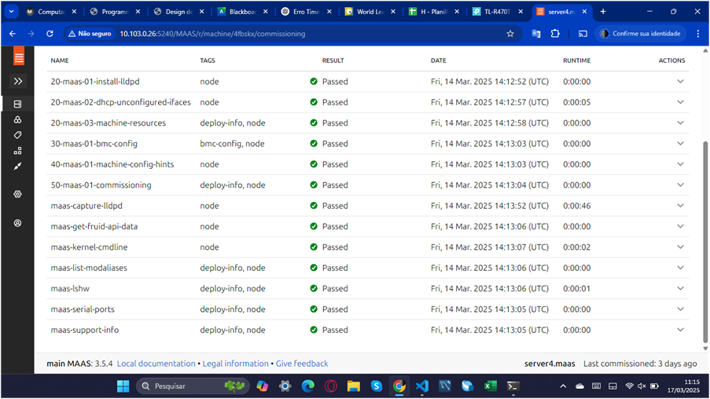
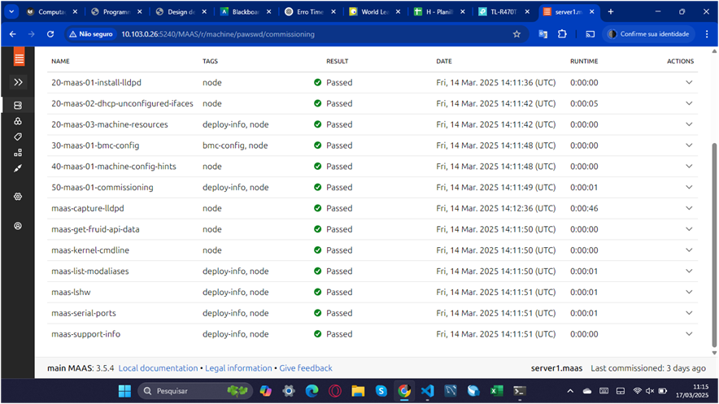
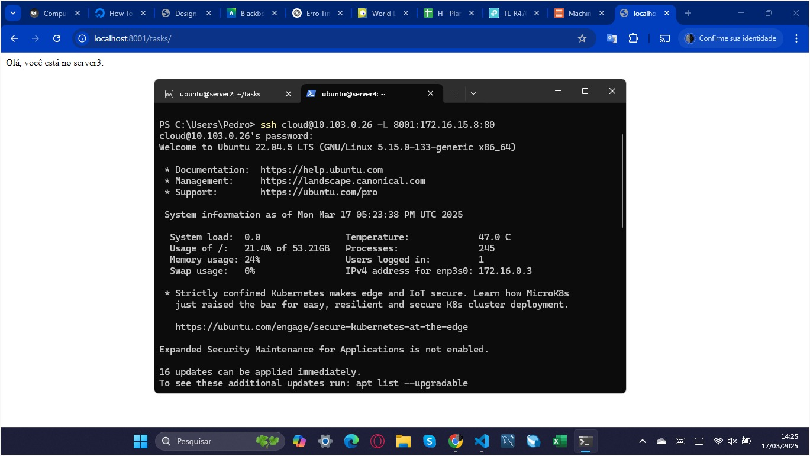
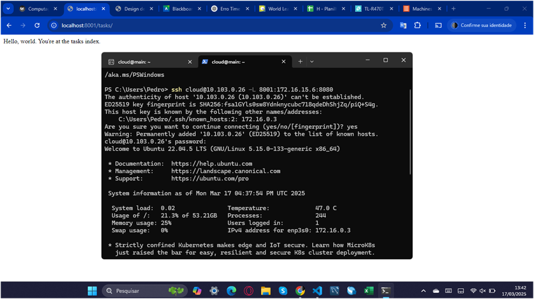

## Objetivo

O presente relatório tem como alvo abstrair os seguintes conhecimentos:

•	Entendimento de conceitos básicos sobre gerenciamento de hardware (Bare Metal) e MaaS (Metal as a Service).

•	Entendimento de conceitos básicos sobre redes de computadores.


### Infraestrutura
Instalação do Ubuntu:

<!-- termynal -->


``` bash
sudo snap install maas --channel=3.5/Stable
```


/// caption
Dashboard do MAAS
///

Conforme ilustrado acima, a tela inicial do MAAS apresenta um dashboard com informações sobre o estado atual dos servidores gerenciados. O dashboard é composto por diversos painéis, cada um exibindo informações sobre um aspecto específico do ambiente gerenciado. Os painéis podem ser configurados e personalizados de acordo com as necessidades do usuário.



## App

### Tarefa 1





[Mermaid](https://mermaid.js.org/syntax/architecture.html){:target="_blank"}


### Tarefa 2

Dashboard do Maas:


Aba com imagens sincronizadas:



Aba da máquina 5 mostrando os testes de hardware e commissioning com Status "OK"


### Tarefa 3

1 - Print da tela do Dashboard do MAAS com as 2 Maquinas e seus respectivos IPs:



2 -  Print da aplicacao Django, provando que voce está conectado ao server:



3 - Configuração com deploy:


### Tarefa 4

1. De um print da tela do Dashboard do MAAS com as 3 Maquinas e seus respectivos IPs.


2. Aplicacao Django, provando que voce está conectado ao server2 

 


3. Explique qual diferenca entre instalar manualmente a aplicacao Django e utilizando o Ansible.



### Acerca do funcionamento do proxy: 


## Questionário, Projeto ou Plano

Esse seção deve ser preenchida apenas se houver demanda do roteiro.

## Discussões

Quais as dificuldades encontradas? O que foi mais fácil? O que foi mais difícil?

## Conclusão

O que foi possível concluir com a realização do roteiro?
