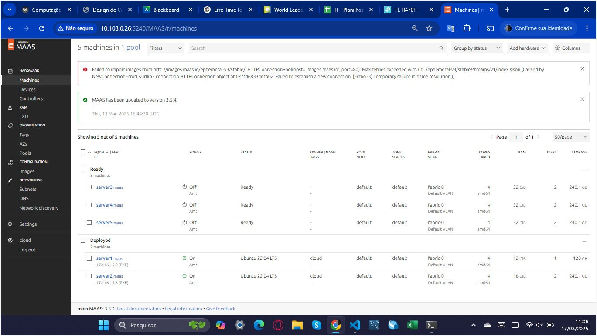

# Roteiro 1 - MAAS
## 1. Objetivo

O presente relatório tem como alvo abstrair os seguintes conhecimentos:

•	Entendimento de conceitos básicos sobre gerenciamento de hardware (Bare Metal) e MaaS (Metal as a Service).

•	Entendimento de conceitos básicos sobre redes de computadores.


## 2. Infraestrutura

O kit utilizado para esta atividade foi composto pelos seguintes itens:

- 1 NUC (main) com 10 GB de RAM e 1 SSD de 120 GB.

- 1 NUC (server1) com 12 GB de RAM e 1 SSD de 120 GB.

- 1 NUC (server2) com 16 GB de RAM e 2 SSDs de 120 GB.

- 3 NUCs (server3, server4, server5) com 32 GB de RAM e 2 SSDs de 120 GB.

- 1 Switch D-Link DSG-1210-28 com 28 portas.

- 1 Roteador TP-Link TL-R470T+.

Para a relização desse roteiro contamos com um ponto de rede (cabo) próprio conectado à rede do Insper e um IP de entrada configurado diretamente no roteador.


### 2.1 Instalação do Ubuntu Server na máquina principal (main)

A primeira etapa da configuração envolveu a instalação do sistema operacional Ubuntu Server 22.04 LTS na máquina principal (NUC main). O procedimento foi realizado via pendrive bootável, configurado previamente com a imagem ISO do Ubuntu.

As definições aplicadas durante a instalação foram:
Instalação do Ubuntu:

Hostname: main

Usuário: cloud

Senha: cloudt

### 2.2 Instalação do MAAS

Com o sistema operacional instalado, foi realizada a instalação do MAAS (Metal as a Service) na versão estável 3.5.3. Antes disso, foram feitos testes de conectividade com os comandos ping para verificar roteamento e resolução de DNS.

Com a conectividade confirmada, os seguintes comandos foram executados:

<!-- termynal -->


``` bash
$ sudo apt update && sudo apt upgrade -y
$ sudo snap install maas --channel=3.5/stable
$ sudo snap install maas-test-db
```


### 2.3 Inicialização do MAAS e criação do administrador

A inicialização do MAAS foi feita com os seguintes comandos:

``` bash
$ sudo maas init region+rack --maas-url http://172.16.0.3:5240/MAAS --database-uri maas-test-db:///
$ sudo maas createadmin
```
Durante a criação do administrador, utilizamos o login cloud, a senha padrão da disciplina e deixamos o campo de chave SSH vazio.

Depois, geramos um par de chaves SSH com senha vazia:

``` bash
$ ssh-keygen -t rsa
$ cat ./.ssh/id_rsa.pub
```

A chave pública gerada foi copiada e registrada no dashboard do MAAS.

### 2.4 Configuração inicial do Dashboard do MAAS e configuração do DHCP

Acessamos o dashboard do MAAS via navegador em http://172.16.0.3:5240/MAAS.

As configurações aplicadas nessa etapa incluíram: Upload da chave SSH gerada; Definição do DNS Forwarder para 172.20.129.131; Importação das imagens do Ubuntu 22.04 LTS e 20.04 LTS; Atualização do parâmetro global net.ifnames=0 em Settings > General.

Também, foi habilitado o serviço de DHCP diretamente no MAAS Controller, com os seguintes ajustes:

- Faixa reservada: de **172.16.11.1** até **172.16.14.255**

- DNS da subrede: **172.20.129.131**

**Obs:**

A integridade do ambiente foi confirmada por meio do painel de controladores do MAAS, onde todos os serviços essenciais, incluindo **regiond**, **rackd** e **dhcpd**, apresentaram status verde.

### 2.5 Comissionamento das máquinas

As NUCs server1 a server5 foram registradas como hosts no MAAS. Todas as máquinas realizaram o boot via PXE e foram comissionadas com sucesso. Após o processo, passaram a apresentar status Ready, com todas as informações de hardware corretamente detectadas.

### 2.6 Criação da OVS bridge (br-ex) e configuração do NAT

Foi criada uma Open vSwitch bridge (OVS) chamada **br-ex** em cada nó de nuvem, utilizando a interface física enp1s0. Essa ponte foi configurada no painel do MAAS, na aba Network de cada máquina. A configuração de **br-ex** é essencial para o funcionamento futuro do OVN e para suportar redes overlay sem exigir múltiplas interfaces físicas por nó.

Finalmente, configuramos um NAT no roteador do kit, liberando acesso externo à máquina principal (main) pela porta 22. Isso permitiu o uso de SSH mesmo fora da rede local.

Também foi criada uma regra de gestão para o endereço 0.0.0.0/0, permitindo acesso remoto à interface de gerenciamento do próprio roteador.

## 3. Aplicação

Fizemos a realização de um deploy manual para uma aplicação simples na nuvem MaaS da nossa dupla.

### 3.1 Ajuste de DNS para deploy Bare Metal

Ajustamos o DNS da nossa rede bare-metal diretamente pelo MAAS. Na aba Subnets, acessamos a subnet 172.16.0.0/20, editamos o campo Subnet summary e substituímos o DNS para o do Insper: **172.20.129.131**.

### 3.2 Deploy manual do banco de dados PostgreSQL no server1

A partir do dashboard do MAAS, realizamos o deploy do Ubuntu 22.04 no server1. Após o deploy, acessamos o terminal via SSH:

``` bash
$ ssh cloud@172.16.15.1
```

No terminal, executamos a instalação do PostgreSQL:

``` bash
$ sudo apt update
$ sudo apt install postgresql postgresql-contrib -y
```

Em seguida, configuramos o banco:

``` bash
$ sudo su - postgres
$ createuser -s cloud -W          
$ createdb -O cloud tasks
```

Alteramos os arquivos de configuração para permitir conexões externas:

``` bash
$ nano /etc/postgresql/14/main/postgresql.conf
# linha: listen_addresses = '*'

$ nano /etc/postgresql/14/main/pg_hba.conf
# linha adicionada: host all all 172.16.0.0/20 trust
```

Por fim, reiniciamos o serviço e liberamos a porta padrão do PostgreSQL:

``` bash
$ sudo ufw allow 5432/tcp
$ sudo systemctl restart postgresql
```

### Tarefa 1 - Validação do banco de dados PostgreSQL

1. Verificação do status do PostgreSQL no server1

O comando sudo systemctl status postgresql foi executado no terminal da máquina server1. A saída mostra que o serviço está com o status active (exited), indicando que o PostgreSQL está corretamente habilitado e funcionando no sistema operacional. Isso comprova que o banco de dados foi inicializado com sucesso e está pronto para receber conexões.


2. Teste de conexão local com o banco de dados PostgreSQL

Na imagem, foi utilizado o comando psql -U cloud -h 172.16.15.0 tasks dentro do próprio server1 para acessar o banco de dados tasks. A autenticação foi feita com sucesso utilizando o usuário cloud, e a conexão foi estabelecida diretamente com o IP da máquina local. A presença do prompt tasks=# confirma que a conexão está ativa e funcional.


3. Acessível a partir da máquina MAIN

Mostra o processo de instalação do postgresql-client, que é o cliente necessário para fazer conexão externa ao banco de dados PostgreSQL, partindo da máquina main.


### 3.3 Deploy da aplicação Django no server2 via MAAS CLI

Acessamos o terminal do main e realizamos login no MAAS:

``` bash
$ maas login cloud http://172.16.0.3:5240/MAAS/
```

Solicitamos a alocação do server2:

``` bash
$ maas cloud machines allocate name=server2
```

Com o system_id retornado, iniciamos o deploy:

``` bash
$ maas cloud machine deploy [system_id]
```

Acessamos o server2 via SSH e iniciamos o processo de instalação da aplicação:

``` bash
$ git clone https://github.com/raulikeda/tasks.git
$ cd tasks
$ ./install.sh
$ sudo reboot
```

### 3.4 Acesso externo via túnel SSH

Com o serviço Django rodando na porta 8080 do server2, realizamos o acesso externo usando um túnel SSH a partir do main:

``` bash
$ ssh cloud@10.103.0.X -L 8001:172.16.15.2:8080
```

Abrimos o navegador e acessamos:


``` bash
http://localhost:8001/admin/
```

### Tarefa 2

1. Comprovação da Infraestrutura MaaS e Imagens

A imagem exibe cinco máquinas registradas no MAAS. Dentre elas, duas (server1 e server2) estão no estado Deployed, com IPs visíveis (172.16.15.0 e 172.16.15.6), o que confirma que já passaram pelo processo de deploy com a imagem do Ubuntu 22.04 LTS. As demais (server3, server4 e server5) estão em estado Ready, prontas para serem utilizadas.



2. Sincronização da imagem Ubuntu 22.04 LTS no MAAS

A imagem da versão 22.04 LTS do Ubuntu (arquitetura amd64) foi devidamente baixada e sincronizada com sucesso, estando marcada como Synced. Isso confirma que a infraestrutura está pronta para realizar deploys com essa versão nas máquinas disponíveis no pool do kit.


3. Comissionamento das máquina com status “Passed”

Agora, vemos os testes de comissionamento realizados nas 5 máquinasTodos os testes — incluindo verificação de interfaces de rede, informações de hardware, portas seriais e hints de configuração — retornaram com status “Passed”, o que garante que o nó foi corretamente detectado e está apto a ser utilizado na nuvem bare-metal. 

Server 1:


Server 2:


Server 3: 


Server 4: 


Server 5:


### 3.5 Deploy automatizado da aplicação no server3 com Ansible

Realizamos a instalação do Ansible no main:

``` bash
$ sudo apt install ansible
$ wget https://raw.githubusercontent.com/raulikeda/tasks/master/tasks-install-playbook.yaml
```

Solicitamos o deploy do server3 via MAAS CLI e rodamos o playbook:

``` bash
$ maas cloud machines allocate name=server3
$ maas cloud machine deploy [system_id]

$ ansible-playbook tasks-install-playbook.yaml --extra-vars server=172.16.15.3
```

A aplicação foi implantada automaticamente, conectando-se ao banco do server1.

### Tarefa 3

1. Máquinas alocadas no MAAS após deploy da aplicação

Vemos que três máquinas (server1, server2 e server3) estão com status Deployed, indicando que foram utilizadas para banco de dados e aplicações Django.


2. Aplicação Django em execução no server2

O print mostra o Hello, world. You're at the tasks index. retornado pela aplicação Django, acessada via navegador local utilizando localhost:8001/tasks. Isso confirma que a aplicação está funcional e acessível.


3. Explicação do Deploy manual

Para realizar o deploy manual da aplicação Django no server2, primeiramente solicitamos a alocação da máquina via MAAS CLI. Em seguida, executamos os comandos para clonar o repositório da aplicação e iniciar o processo de instalação via o script install.sh. O serviço foi configurado para escutar na porta 8080, e o acesso externo foi possível através da criação de um túnel SSH a partir do main, redirecionando o tráfego da porta 8001 local para a porta 8080 do server2. Esse procedimento permitiu validar o funcionamento completo da aplicação hospedada na máquina provisionada.

### 3.6 Configuração do Load Balancer com NGINX no server4

Instalamos o NGINX no server4:

``` bash
$ sudo apt-get install nginx
```

Editamos o arquivo de configuração padrão:

``` bash
$ sudo nano /etc/nginx/sites-available/default
```

Adicionamos o módulo de balanceamento:


``` bash
upstream backend {
    server 172.16.15.2:8080;
    server 172.16.15.3:8080;
}

server {
    listen 80;
    location / {
        proxy_pass http://backend;
    }
}
```
Reiniciamos o serviço:


``` bash
$ sudo service nginx restart
```

Modificamos o conteúdo da função index() no arquivo tasks/views.py de cada servidor para exibir uma mensagem personalizada, identificando qual servidor respondeu a requisição.

### Tarefa 4

2. Acesso ao Server2 via túnel SSH

A imagem mostra o terminal local conectado ao server2 via SSH. Este túnel permite o redirecionamento do tráfego da porta 8001 do computador local para a porta 8080 do server2, onde a aplicação Django está hospedada. Vendo o texto padrão no fundo, confirmamos o funcionamento da aplicação Django no Server 2.


3. Acesso ao Server3 via túnel SSH

O mesmo racional do acesso ao server 2, mas para o server3.


4. Diferença entre instalação manual e via Ansible

A instalação manual exige executar cada passo diretamente no terminal (como clonar o repositório, rodar install.sh, configurar dependências e reiniciar). Já com o Ansible, tudo é feito automaticamente por meio de um playbook, o que economiza tempo, reduz erros e garante que o processo seja idêntico em vários servidores.

### Tarefa 5

1. Quatro máquinas no estado Deployed com IPs visíveis no MAAS

Vemos o dashboard do MAAS com quatro máquinas no estado Deployed (server1, server2, server3 e server4), cada uma com seu respectivo IP visível. Essa visualização confirma que os nós estão devidamente provisionados com Ubuntu 22.04 LTS e prontos para operação, incluindo o server4, que atuará como balanceador de carga via NGINX.


2. GET request mostra resposta da aplicação no server3 e server 2 via proxy reverso

Por fim, notamos o conteúdo acessado via localhost:8001/tasks/, que está sendo redirecionado através do proxy reverso configurado no server4 (NGINX). As mensagens "Olá, você está no server3." e "Olá, você está no server2." confirmam funcionamento do balanceamento de carga via NGINX. 

Server3: 


Server2:


### 3.7 Finalização e limpeza do ambiente

Após os testes, realizamos o release de todos os servidores do kit através do dashboard do MAAS. Esse processo liberou os recursos de hardware utilizados para as aplicações e preparou o ambiente para futuros testes.


