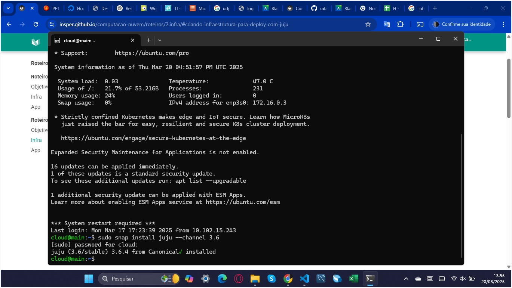

## Objetivo

Tendo compreendido o relatório 1, o presente relatório tem como alvo os seguintes objetivos com Deployment Orchestration:

•	Automatizar a infraestrutura: Reduz a complexidade e garante consistência nas implantações.

•	Gerenciamento centralizado: Permite administração eficiente de múltiplos servidores.

•	Eficiência operacional: Minimiza erros humanos e acelera a configuração.

•	Escalabilidade: Adapta a infraestrutura conforme a demanda.

•	Integração com provedores: Usa recursos físicos de forma otimizada.

### Criando a Estrutura para Deploy com Juju 

Acerca da 
<!-- termynal -->


``` bash
 clouds:
    maas-one:
      type: maas
      auth-types: [oauth1]
      endpoint: http://192.168.0.3:5240/MAAS/
      
```




``` bash
$ juju add-cloud --client -f maas-cloud.yaml maas-one
```

``` bash
credentials:
  maas-one:
  anyuser:
    auth-type: oauth1
    maas-oauth: <API KEY>
```

``` bash
$ juju add-credential --client -f maas-creds.yaml maas-one
```

``` bash
$ juju bootstrap --bootstrap-series=jammy --constraints tags=juju maas-one maas-controller
```

``` bash
$ juju status
```

### Utilizando a infraestrutura Bare Metal com o Juju

Em relação aos tipos de arquiteturas utilizados

### Instalação o Dashboard do JUJU para o controlador principal (controller)

Execute o seguinte comando no terminal para habilitar o Dashboard no controlador Juj
