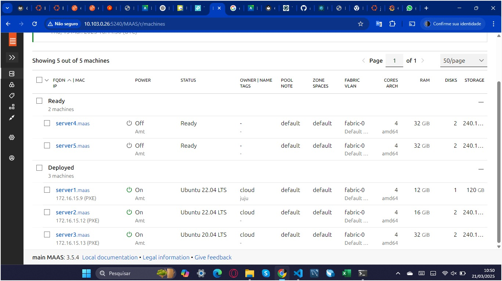
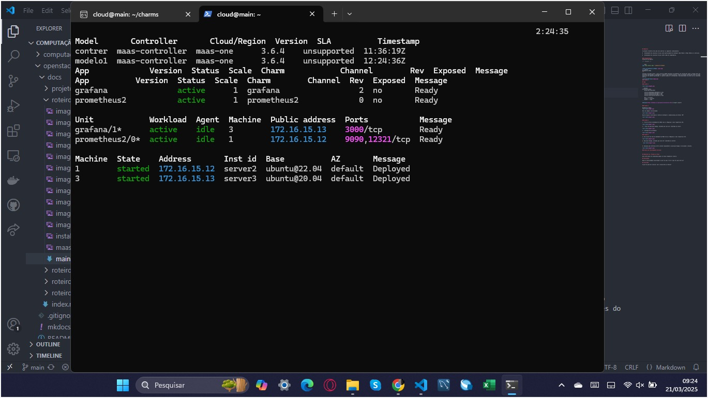
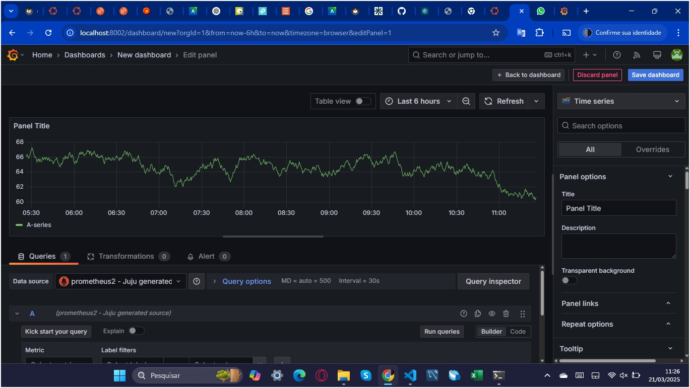
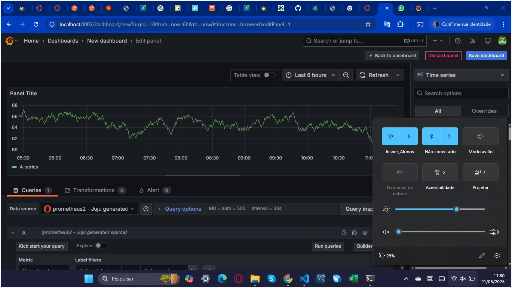
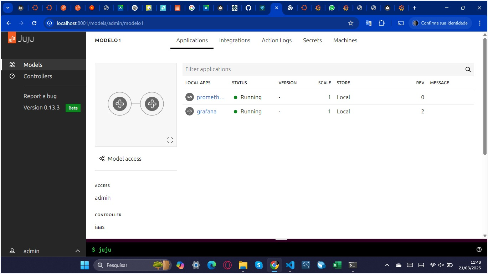

# Roteiro 2 - Juju

## 1. Objetivo

Tendo compreendido o relatório 1, o presente relatório tem como alvo os seguintes objetivos com Deployment Orchestration:

•	Automatizar a infraestrutura, reduzindo a complexidade e garantindo consistência nas implantações.

•	Gerenciamento centralizado, permitindo administração eficiente de múltiplos servidores.

•	Integração com provedores, usando recursos físicos de forma otimizada.

## 2. Infraestrutura 

### 2.1 Por que utilizar o Juju para Deployment Orchestration?

O Juju é uma ferramenta de orquestração que atua desde o provisionamento até a configuração e integração de serviços. Ao contrário do Ansible, que se limita à configuração de máquinas já provisionadas, o Juju se integra diretamente com o MAAS (Metal as a Service), permitindo orquestrar o ambiente Bare Metal de forma completa e automatizada.

### 2.2 Instalação do Juju

Inicialmente, foi necessário acessar o dashboard do MAAS e garantir que todas as máquinas nomeadas como server1, server2, server3, server4 e server5 estivessem com status Ready. Realizamos o release das máquinas que haviam sido anteriormente utilizadas para as aplicações Django e PostgreSQL, a fim de garantir que estivessem disponíveis para novas alocações.

Tendo as máquinas prontas,  acessamos o nó principal (main) via SSH para a instalação do Juju. A instalação foi realizada utilizando o Snap com o canal da versão 3.6:


``` bash
$ sudo snap install juju --channel 3.6
```

### 2.3 Configuração da Cloud MAAS no Juju

Após a instalação do Juju, foi necessário garantir que o MAAS estivesse ***visível como provedor*** de cloud. Para isso, executamos o comando:

``` bash
$ juju clouds
```

**É importante notar que:**

Como o MAAS não apareceu na listagem, adicionamos manualmente uma nova cloud por meio de um arquivo de configuração chamado maas-cloud.yaml, com o seguinte conteúdo:

``` bash
clouds:
  maas-one:
    type: maas
    auth-types: [oauth1]
    endpoint: http://192.168.0.3:5240/MAAS/
```

Em seguida, adicionamos a cloud com o comando:

``` bash
$ juju add-cloud --client -f maas-cloud.yaml maas-one
```
### 2.4 Adição de credenciais ao Juju

Para permitir que o Juju se autenticasse e interagisse com o MAAS, criamos o arquivo maas-creds.yaml, contendo as credenciais de autenticação:

``` bash
credentials:
  maas-one:
    anyuser:
      auth-type: oauth1
      maas-oauth: <API KEY>
```

O valor <API KEY> foi substituído pela chave gerada no MAAS, disponível no menu do usuário.

As credenciais foram adicionadas com o comando:


``` bash
$ juju add-credential --client -f maas-creds.yaml maas-one
```

### 2.5 Bootstrap do controller do Juju

Para iniciar o uso do Juju, foi necessário criar um controller, responsável por gerenciar os deploys futuros. Antes do bootstrap, acessamos o dashboard do MAAS e aplicamos a tag juju à máquina server1.

O comando utilizado para o bootstrap foi:

``` bash
$ juju bootstrap --bootstrap-series=jammy --constraints tags=juju maas-one maas-controller
```

Esse processo levou alguns minutos, pois envolveu o provisionamento da máquina e a instalação do agente de controle do Juju. Ao final, validamos o sucesso da operação com:

``` bash
$ juju status
```

O controller foi iniciado com sucesso e passou a ser a interface principal entre os comandos do juju-cli e a infraestrutura gerenciada via MAAS.


## 3. Aplicação

### 3.1 Configuração do modelo para deploy das aplicações

Com o controller já inicializado, realizamos a instalação do Dashboard do Juju - o que permitiu a visualização gráfica dos modelos, aplicações e unidades gerenciadas;

Após esse acesso, retornamos ao terminal e listamos os modelos disponíveis com:

``` bash
$ juju models
```

Em seguida, foi feito o switch para o modelo padrão do controller com o comando:

``` bash
$ juju switch maas-controller:admin/maas
```

Dessa forma, garantimos que Grafana e Prometheus fossem implantados no modelo correto.

### 3.2 Preparação dos charms locais

Para realizar o deploy local das aplicações, foi criada uma pasta dedicada para armazenar os charms baixados do Charmhub:

``` bash
$ mkdir -p /home/cloud/charms
$ cd /home/cloud/charms
```
Em seguida, baixamos:

``` bash
$ juju download grafana
$ juju download prometheus2
```

### 3.3 Deploy dos serviços

Com a utilização do charm local, fizemos:

``` bash
$ juju deploy ./prometheus2_XXX.charm
$ juju deploy ./grafana_XXX.charm
```
**Note que:**

Enquanto ocorria o deploy, observamos analisando o ***status*** do Juju.

### 3.4 Integração, validação e visualização dos serviços

Com os serviços Grafana e Prometheus em estado ***active***, realizamos a integração entre eles utilizando os procedimentos descritos no README do charm do Grafana. A integração foi feita por meio da interface gráfica do Grafana, acessando o painel, criando um novo dashboard e configurando o Prometheus como fonte de dados (source).

Na sequência, validamos o funcionamento da aplicação acessando o dashboard do Grafana a partir da rede do Insper. A conexão foi estabelecida com sucesso, comprovando a disponibilidade da aplicação fora do ambiente local.

Por fim, acessamos a interface gráfica do Juju, visualisando as aplicações implantadas e em execução dentro do modelo ativo.

## Tarefa

### 1. Visualização das máquinas no Dashboard do MAAS

A imagem abaixo mostra o painel do MAAS com as cinco máquinas cadastradas, onde duas estão com status Ready (prontas para uso) e três estão em estado Deployed, indicando que estão em operação. É possível visualizar também os IPs atribuídos a cada máquina ativa.



### 2. Verificação do estado dos serviços com juju status

O comando juju status foi executado após o deploy completo das aplicações. A imagem a seguir mostra que tanto o Grafana quanto o Prometheus estão no estado active, indicando que os serviços estão operando corretamente. Também é possível verificar as portas abertas e os IPs atribuídos.




### 3. Integração entre Grafana e Prometheus no dashboard

Nesta etapa, foi acessado o dashboard do Grafana, onde foi criado um painel que utiliza o Prometheus como fonte de dados (source). A imagem mostra o gráfico gerado a partir da consulta realizada no Prometheus.



### 4. Acesso ao Grafana a partir da rede do Insper

A próxima imagem comprova o acesso ao dashboard do Grafana a partir da rede do Insper, como evidenciado pela conexão ativa à rede "Insper_Alunos". Isso demonstra que a aplicação está acessível fora da rede local do KIT.



### 5. Visualização das aplicações em execução no Dashboard do Juju

Por fim, acessamos a interface gráfica do Juju para visualizar o modelo em uso e confirmar que as aplicações estão sendo gerenciadas corretamente. A imagem mostra o Grafana e o Prometheus com status Running, ambos implantados localmente.




