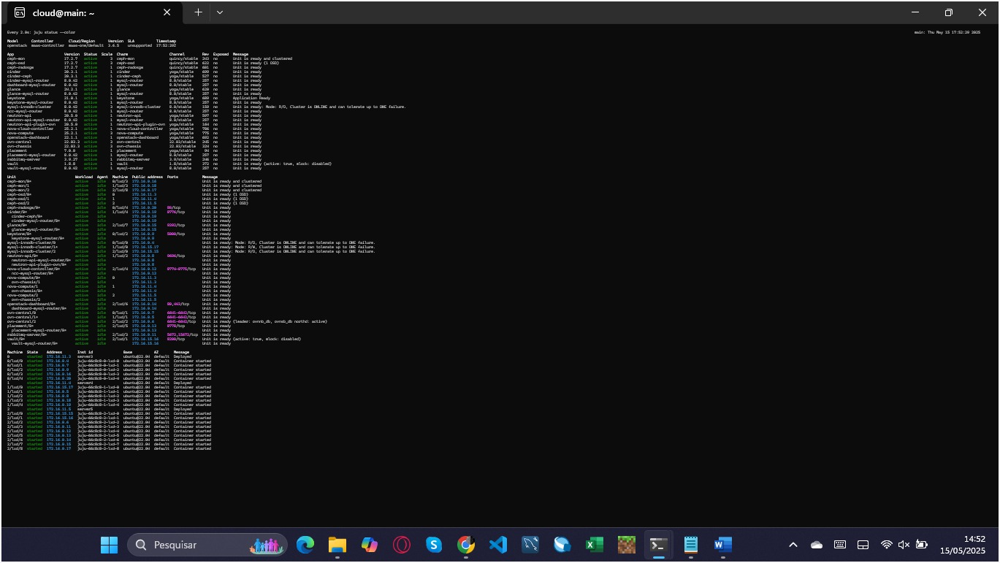
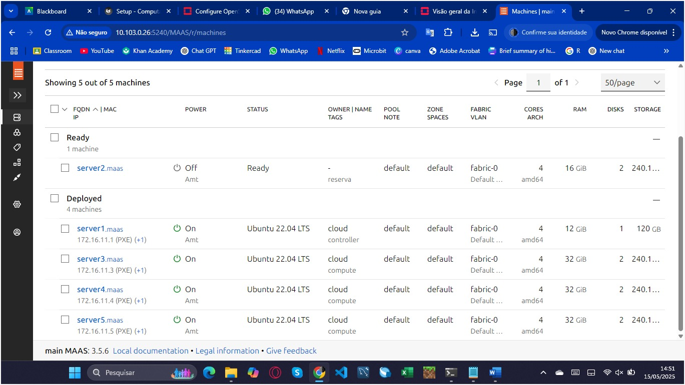
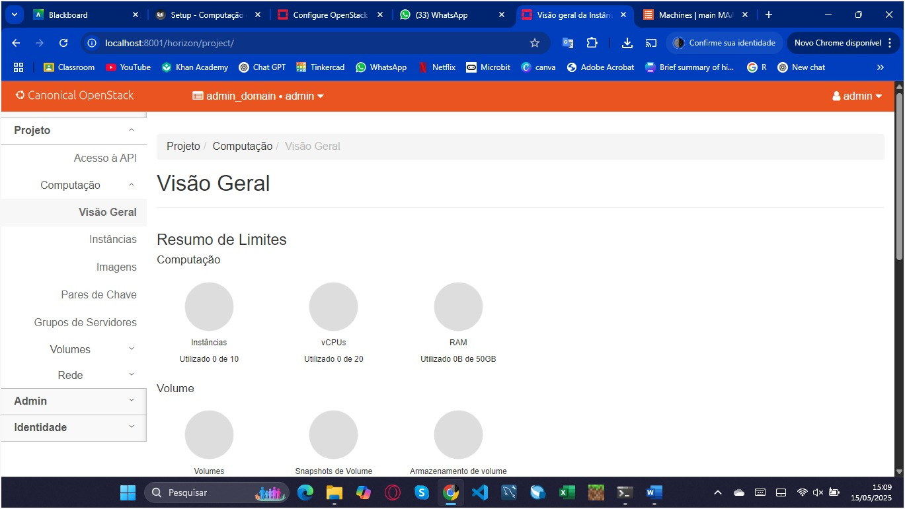
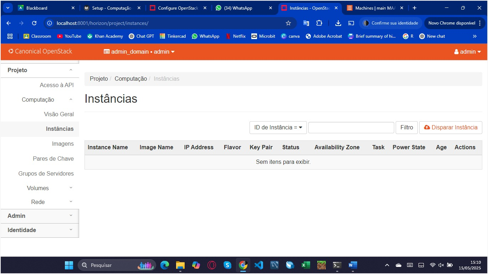
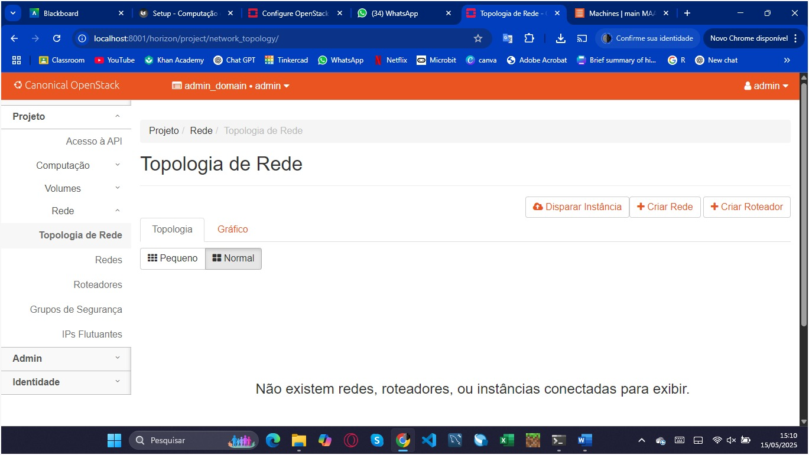
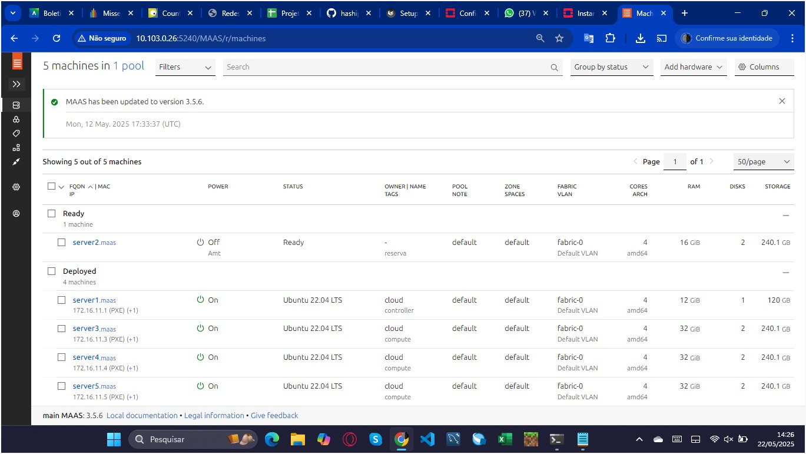
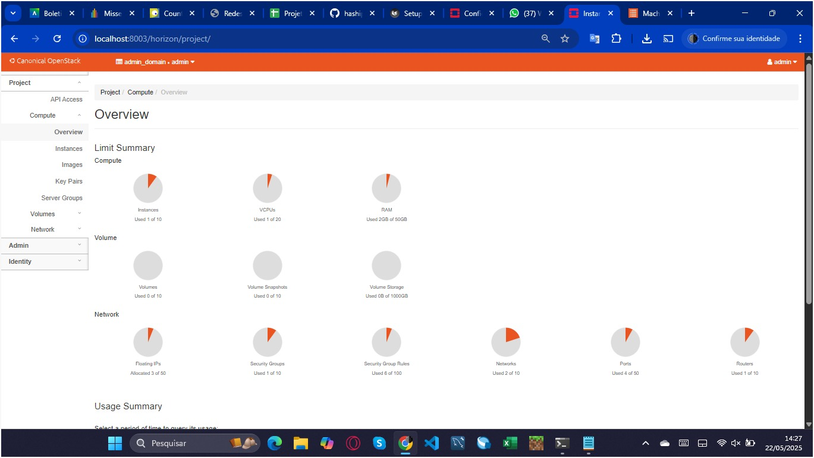
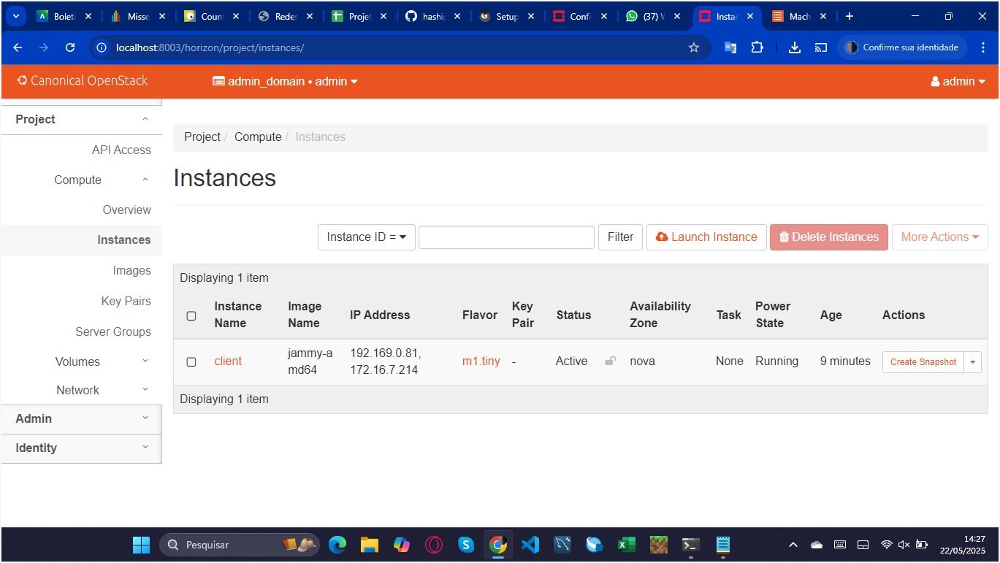
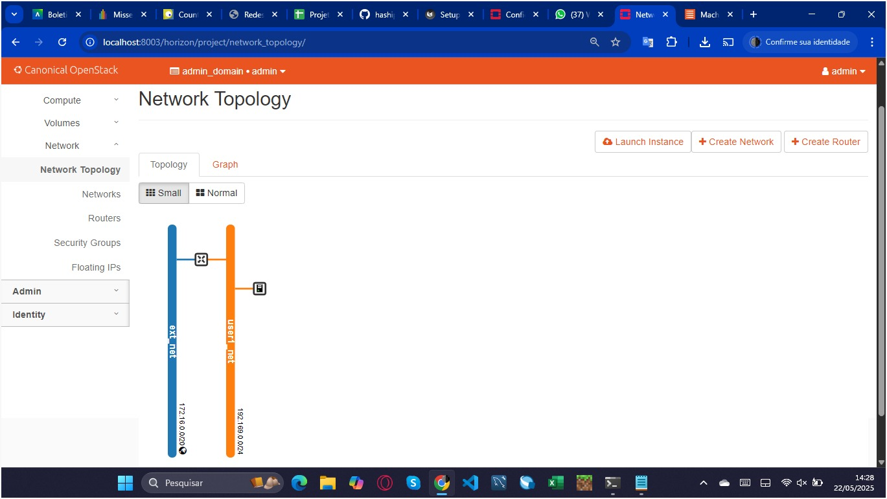

# Roteiro 3 – Private Cloud com OpenStack

## 1. Objetivos

Este roteiro dá sequência aos anteriores (MAAS e Juju) e foca na criação de uma nuvem privada baseada em OpenStack, usando o mesmo kit de servidores. Aqui definimos o que será feito e por quê. Assim é necessário:

- Reconhecer o que é uma nuvem privada e por que usá-la dentro do laboratório.

- Entender, de forma básica, os principais blocos do OpenStack (controle, computação, rede e armazenamento).

- Montar a infraestrutura física mínima necessária para o cluster.

- Instalar o OpenStack (via Juju + MAAS) em modo funcional, ainda que não-HA.

- Testar a criação de uma VM, rede interna e volume para validar o ambiente.

## 2. Infraestrutura

Neste roteiro, instalamos o OpenStack sobre o kit, continuando a usar o MAAS para orquestrar o bare-metal e o Juju para implantar os serviços; isso permitiu criar e distribuir VMs de modo eficiente entre todos os nós. A implantação seguiu o guia oficial do OpenStack, já adaptado ao nosso ambiente:

- Papéis dos nós – server1 atuou como controller (e hospedou o Juju Controller); server2 ficou reservado para contingência; server3-5 funcionaram como compute.

- Monitoramento em tempo real – em um terminal extra, executamos:

```bash
watch -n 2 --color "juju status --color"
```
para acompanhar a instalação a cada 2 s.

Com essa estrutura definida, prosseguimos para os detalhes de hardware, rede e mapeamento de serviços.

### 2.1 Juju Controller

Instalamos o Juju Controller no server1, após aplicar a tag controller, usando:

```bash
juju bootstrap --bootstrap-series=jammy \
  --constraints tags=controller \
  maas-one maas-controller
```
Esse nó passou a gerenciar todo o deploy do OpenStack.

### 2.2 Modelo de deploy

Criamos o modelo openstack e mudamos para ele:

```bash
juju add-model --config default-series=jammy openstack
juju switch maas-controller:openstack
```
(O Juju Dashboard pôde ser habilitado opcionalmente.)

### 2.3 Ceph OSD

Preparamos o arquivo ceph-osd.yaml indicando os discos (/dev/sda /dev/sdb) e implantamos três unidades — uma em cada nó compute (server3-5):

```bash
juju deploy -n 3 \
  --channel quincy/stable \
  --config ceph-osd.yaml \
  --constraints tags=compute \
  ceph-osd
```

### 2.4 Nova Compute

Criamos nova-compute.yaml (live-migration, resize, QEMU, etc.) e distribuímos três unidades de nova-compute nos mesmos nós compute:

```bash
juju deploy -n 3 \
  --to 0,1,2 \
  --channel yoga/stable \
  --config nova-compute.yaml \
  nova-compute
```

### 2.5 MySQL InnoDB Cluster

Implantamos o banco de dados MySQL em contêineres LXD sobre os três nós compute:

```bash
juju deploy -n 3 \
  --to lxd:0,lxd:1,lxd:2 \
  --channel 8.0/stable \
  mysql-innodb-cluster
```

### 2.6 Vault

Implantamos Vault num contêiner LXD do server5, configurando o roteamento MySQL e integrando-o ao cluster:

```bash
juju deploy --to lxd:2 --channel 1.8/stable vault
juju deploy --channel 8.0/stable mysql-router vault-mysql-router
juju integrate vault-mysql-router:db-router      mysql-innodb-cluster:db-router
juju integrate vault-mysql-router:shared-db      vault:shared-db
juju run vault/leader generate-root-ca
juju integrate mysql-innodb-cluster:certificates vault:certificates
```

Após isso, inicializamos e unsealamos o Vault conforme a documentação.

### 2.7 Neutron + OVN 

Criamos neutron.yaml com mapeamentos de bridge (br-ex) e provider physnet1. Implantamos:

```bash
juju deploy -n 3 --to lxd:0,lxd:1,lxd:2 \
  --channel 22.03/stable ovn-central

juju deploy --to lxd:1 --channel yoga/stable \
  --config neutron.yaml neutron-api

juju deploy --channel yoga/stable   neutron-api-plugin-ovn
juju deploy --channel 22.03/stable  --config neutron.yaml ovn-chassis
```

Integrações principais:

```bash
juju integrate neutron-api-plugin-ovn:neutron-plugin neutron-api:neutron-plugin-api-subordinate
juju integrate neutron-api-plugin-ovn:ovsdb-cms ovn-central:ovsdb-cms
juju integrate ovn-chassis:ovsdb ovn-central:ovsdb
juju integrate ovn-chassis:nova-compute nova-compute:neutron-plugin
for app in neutron-api neutron-api-plugin-ovn ovn-central ovn-chassis; do
  juju integrate $app:certificates vault:certificates
done
juju deploy --channel 8.0/stable mysql-router neutron-api-mysql-router
juju integrate neutron-api-mysql-router:db-router  mysql-innodb-cluster:db-router
juju integrate neutron-api-mysql-router:shared-db neutron-api:shared-db
```

### 2.8 Keystone

Implantamos Keystone em contêiner LXD do server3 e o conectamos ao banco e aos serviços:

```bash
juju deploy --to lxd:0 --channel yoga/stable keystone
juju deploy --channel 8.0/stable mysql-router keystone-mysql-router
juju integrate keystone-mysql-router:db-router mysql-innodb-cluster:db-router
juju integrate keystone-mysql-router:shared-db keystone:shared-db
juju integrate keystone:identity-service neutron-api:identity-service
juju integrate keystone:certificates       vault:certificates
```

### 2.9 RabbitMQ

Por fim, provisionamos RabbitMQ em contêiner LXD do server5 e ligamos suas filas aos serviços de rede e compute:

```bash
juju deploy --to lxd:2 --channel 3.9/stable rabbitmq-server
juju integrate rabbitmq-server:amqp neutron-api:amqp
juju integrate rabbitmq-server:amqp nova-compute:amqp
```

Com todos esses passos concluídos e monitorados por meio de:

```bash
watch -n 2 --color "juju status --color"
```

os units chegaram a active/idle, validando a instalação básica do OpenStack.

### 2.10 Nova Cloud Controller

Criamos o arquivo ncc.yaml (network-manager: Neutron) e implantamos o serviço Nova Cloud Controller em um contêiner LXD do server5:

```bash
juju deploy --to lxd:2 --channel yoga/stable --config ncc.yaml nova-cloud-controller

juju deploy --channel 8.0/stable mysql-router ncc-mysql-router
juju integrate ncc-mysql-router:db-router   mysql-innodb-cluster:db-router
juju integrate ncc-mysql-router:shared-db   nova-cloud-controller:shared-db

juju integrate nova-cloud-controller:identity-service keystone:identity-service
juju integrate nova-cloud-controller:amqp            rabbitmq-server:amqp
juju integrate nova-cloud-controller:neutron-api      neutron-api:neutron-api
juju integrate nova-cloud-controller:cloud-compute    nova-compute:cloud-compute
juju integrate nova-cloud-controller:certificates     vault:certificates
```

### 2.11 Placement

Implantamos o serviço Placement, também em contêiner LXD do server5, e o integramos ao banco de dados:

```bash
juju deploy --to lxd:2 --channel yoga/stable placement

juju deploy --channel 8.0/stable mysql-router placement-mysql-router
juju integrate placement-mysql-router:db-router  mysql-innodb-cluster:db-router
juju integrate placement-mysql-router:shared-db placement:shared-db

juju integrate placement:identity-service keystone:identity-service
juju integrate placement:placement         nova-cloud-controller:placement
juju integrate placement:certificates      vault:certificates
```

### 2.12 Horizon (Dashboard)

Implantamos o Horizon em outro contêiner LXD do server5:

```bash
juju deploy --to lxd:2 --channel yoga/stable openstack-dashboard

juju deploy --channel 8.0/stable mysql-router dashboard-mysql-router
juju integrate dashboard-mysql-router:db-router  mysql-innodb-cluster:db-router
juju integrate dashboard-mysql-router:shared-db openstack-dashboard:shared-db

juju integrate openstack-dashboard:identity-service keystone:identity-service
juju integrate openstack-dashboard:certificates   vault:certificates
```

### 2.13 Glance

Implantamos o Glance no mesmo host LXD (server5) e o configuramos para usar Ceph:

```bash
juju deploy --to lxd:2 --channel yoga/stable glance

juju deploy --channel 8.0/stable mysql-router glance-mysql-router
juju integrate glance-mysql-router:db-router  mysql-innodb-cluster:db-router
juju integrate glance-mysql-router:shared-db glance:shared-db

juju integrate glance:image-service    nova-cloud-controller:image-service
juju integrate glance:image-service    nova-compute:image-service
juju integrate glance:identity-service keystone:identity-service
juju integrate glance:certificates     vault:certificates
```
### 2.14 Ceph Monitor

Criamos ceph-mon.yaml com expected-osd-count: 3 e implantamos três monitores Ceph em contêineres LXD (um em cada nó compute):

```bash
juju deploy -n 3 --to lxd:0,lxd:1,lxd:2 \
     --channel quincy/stable --config ceph-mon.yaml ceph-mon

juju integrate ceph-mon:osd    ceph-osd:mon
juju integrate ceph-mon:client nova-compute:ceph
juju integrate ceph-mon:client glance:ceph
```

### 2.15 Cinder

Criamos cinder.yaml (block-device: None) e implantamos o Cinder em contêiner LXD do server4:

```bash
juju deploy --to lxd:1 --channel yoga/stable --config cinder.yaml cinder

juju deploy --channel 8.0/stable mysql-router cinder-mysql-router
juju integrate cinder-mysql-router:db-router  mysql-innodb-cluster:db-router
juju integrate cinder-mysql-router:shared-db cinder:shared-db

juju integrate cinder:cinder-volume-service nova-cloud-controller:cinder-volume-service
juju integrate cinder:identity-service       keystone:identity-service
juju integrate cinder:amqp                   rabbitmq-server:amqp
juju integrate cinder:image-service          glance:image-service
juju integrate cinder:certificates           vault:certificates
```

Para usar Ceph como backend, adicionamos o charm subordinado:

```bash
juju deploy --channel yoga/stable cinder-ceph
juju integrate cinder-ceph:storage-backend cinder:storage-backend
juju integrate cinder-ceph:ceph            ceph-mon:client
juju integrate cinder-ceph:ceph-access     nova-compute:ceph-access
```

### 2.16 Ceph RADOS Gateway

Implantamos o Ceph RGW (gateway S3/Swift) em contêiner LXD do server3:

```bash
juju deploy --to lxd:0 --channel quincy/stable ceph-radosgw
juju integrate ceph-radosgw:mon ceph-mon:radosgw
```

### 2.17 Configuração final dos discos Ceph OSD

Depois de validar todos os serviços, aplicamos a configuração definitiva dos discos OSD:

```bash
juju config ceph-osd osd-devices='/dev/sdb'
```

### 2.18 Acerca do Fim da Infra

Monitoramos continuamente e avançamos apenas quando todos os units ficaram em active/idle sem erros. Assim, concluímos a implantação do OpenStack via Juju + MAAS; a nuvem ficou pronta para criar redes, imagens e usuários finais.

## 3. Setup 

Foi necessário configurar o Openstack, em destaque os serviços que controlam:

- As VMs (Nova)

- Os volumes de disco (Cinder)

- A estrutura de rede virtual (Neutron)

### 3.1 Autenticação (Keystone)

1. Geramos e baixamos o arquivo openrc contendo OS_AUTH_URL, OS_PROJECT_NAME, OS_USERNAME, OS_PASSWORD, OS_USER_DOMAIN_NAME, OS_PROJECT_DOMAIN_NAME e OS_REGION_NAME.

2. Carregamos as variáveis no shell:

```bash
source openrc
```

3. Confirmamos o acesso listando os serviços:

```bash
openstack service list
```

### 3.2 Acompanhamento em tempo real (Horizon)

Abrimos o Horizon em http://<IP-controller>/horizon, domínio admin_domain, usuário admin, e o deixamos ativo para visualizar as mudanças.

### Tarefa - 1

Prints iniciais:

#### (a) Status do Juju



#### (b) Dashboard do MAAS com as máquinas



#### (c) Aba overview



#### (d) Aba instances 



#### (e) Aba topology



### 3.3 Imagens e Flavors

1. Instalamos o OpenStack client via snap.

2. Habilitamos DNS interno no Neutron:

```bash
juju config neutron-api enable-ml2-dns="true"
juju config neutron-api-plugin-ovn dns-servers="172.16.0.1"
```

3. Importamos a imagem Ubuntu 22.04 (Jammy) no Glance.

4. Criamos quatro flavors (sem disco efêmero).

### 3.4 Rede externa

Definimos a rede public (flat, provider physnet1) com faixa 172.16.7.0 – 172.16.8.255, gateway em 172.16.7.1 e pool de floating IPs reservado.

### 3.5 Rede interna & roteador

Criamos a rede private (192.169.0.0/24, sem DNS) e Adicionamos um roteador ligando private à rede public e habilitamos NAT.

### 3.6 Segurança e chaves

Importamos o par de chaves SSH (~/.ssh/id_rsa.pub) como key-pair padrão e Ajustamos o security group default para permitir SSH (22) e ICMP de qualquer origem.

### 3.7 Instância de validação

1. Lançamos a VM client (flavor m1.tiny, imagem Jammy, rede private, sem volume novo).

2. Associamos um floating IP.

3. Testamos ping e SSH a partir do main; conexão bem-sucedida confirmou rotas, DHCP e DNS internos.

### 3.8 Escalonamento dos nós

1. Liberamos (release) o server2 no MAAS e, em seguida, adicionamos:

```bash
juju add-unit nova-compute          # novo nó de computação  
juju add-unit --to <machine-id> ceph-osd   # backend extra de storage  
```

2. Verificamos no Horizon que o hipervisor e o OSD extra apareceram disponíveis.

### Tarefa 2 

#### 1. Prints Pós-Setup

#### (a) Dashboard MAAS com as máquinas



#### (b) Aba Overview



#### (c) Aba instances



#### (d) Aba topology



#### 2. Diferenças encontradas entre os prints das telas na Tarefa 1 e na Tarefa 2

1. Dashboard do MAAS – na primeira captura, o server2 aparecia apenas como “Allocated/Ready”, ainda sem sistema instalado. Depois do setup ele surgiu como “Deployed”, indicando que foi instalado e passou a integrar o cluster.

2. Compute › Overview (Horizon) – inicialmente o painel listava três hipervisores (server3, 4 e 5) com zero vCPU e memória em uso. Após as configurações, um quarto hipervisor (server2) aparece e já se nota consumo de 1 vCPU e 1 GB de RAM, refletindo a execução da VM de teste.

3. Compute › Instances (Horizon) – antes não havia nenhuma instância; agora existe a VM chamada client, estado Active, lançada no flavor m1.tiny, conectada à rede private e com um floating IP associado.

4. Network › Topology (Horizon) – a topologia inicial exibia apenas a rede provider (physnet1). Depois do setup vimos a rede externa public, a rede interna private, o roteador router1 unindo as duas sub-redes e a porta da instância client, confirmando que o plano de rede virtual foi construído corretamente.

#### 3. Origem de cada novo recurso

1. Hiper­visor e OSD no server2 – liberamos o nó reserva no MAAS, depois executamos juju add-unit nova-compute para transformá-lo em nó de computação e juju add-unit --to <machine-id> ceph-osd para acrescentar um OSD de armazenamento.

2. Imagem Ubuntu Jammy – baixamos a QCOW2 oficial e a carregamos no Glance via openstack image create, definindo formato qcow2 e nome “ubuntu-jammy”.

3. Flavors m1.tiny, m1.small, m1.medium e m1.large – criados com openstack flavor create, especificando vCPU, RAM e disco conforme a planilha do roteiro, todos sem disco efêmero.

4. Rede externa public – construída com openstack network create usando tipo flat em physnet1; em seguida openstack subnet create definiu a faixa 172.16.7.0/23 (pool de 172.16.7.10 a 172.16.8.250) e gateway 172.16.7.1.

5. Rede interna private – criada via openstack network create private e openstack subnet create com o CIDR 192.169.0.0/24, sem DNS.

6. Roteador router1 – gerado com openstack router create, configurado com gateway externo (public) e adicionado à subnet private para habilitar NAT.

7. Key-pair principal – importado no CLI com openstack keypair create --public-key ~/.ssh/id_rsa.pub main-key, permitindo login por SSH nas VMs.

8. Regras de segurança – no Horizon, editamos o security group default para liberar tráfego SSH (porta 22) e ICMP (ping) para qualquer origem.

9. Instância client – lançada pelo Horizon, selecionando imagem Jammy, flavor m1.tiny, rede private e a key main-key.

10. Floating IP – alocado do pool da rede public e associado à VM pelo menu Associate Floating IP no Horizon.

### 3.9 Openstack Funcional

Com o OpenStack funcional, planejamos:

1. Automatizar a criação de projetos e quotas para usuários finais.

2. Publicar imagens customizadas (Docker-ready, GPU etc.).

3. Documentar a política de alocação de floating IPs e monitorar uso via Grafana/Prometheus já existentes no cluster.

### Tarefa 3 

                           +--------------------+
                           |      INSPER        |
                           +---------+----------+
                                     |
                                     v    (link externo)
                           +---------+----------+
                           |  Roteador TP-Link  |
                           +---------+----------+
                                     |
                                     v    (cabo LAN)
                           +---------+----------+
                           | Switch D-Link 28p  |
                           +---------+----------+
            __________________|________|________________________
           |        |          |        |        |        |      |
           v        v          v        v        v        v      v
      +--------+ +--------+ +--------+ +--------+ +--------+ +--------+
      |  Main  | |Server1 | |Server2 | |Server3 | |Server4 | |Server5 |
      | (MAAS  | |Controller|Compute | |Compute | |Compute | |Compute |
      | + Juju)| |  + API  |+OSD+VMs| |+OSD+VMs| |+OSD+VMs| |+OSD+VMs|
      +--+--+--+ +----+---+ +----+---+ +----+---+ +----+---+ +----+---+
         | br-ex     | br-ex   | br-ex   | br-ex   | br-ex   | br-ex
         |           |         |         |         |         |
         |           |         |         |         |         |
         |      +----+---------+-----------------------------------+
         |      |                    PublicNet (172.16.7.0/23)     |
         |      +----+---------------------------------------------+
         |           |
         |           |  *Floating IP pool*
         |           v
         |      +----+----+
         |      | Router1 |  (Neutron L3, NAT)
         |      +----+----+
         |           |
         |           |  *interface interna*
         v           v
+-----------------------------+
|   PrivateNet (192.169.0.0)  |
+--------------+--------------+
               |
               v
         +-----+-----+
         |  VM client|   (m1.tiny, key-pair main-key)
         +-----------+


## 4. App

Nesta etapa levantamos as aplicações do projeto em quatro VMs na nuvem OpenStack:

- 2 × API (FastAPI, etapa 1)

- 1 × Banco de dados (PostgreSQL, etapa 1)

- 1 × Load-Balancer (Nginx)

Todas as instâncias foram criadas dentro da rede PrivateNet (192.169.0.0/24) e expostas ao mundo por meio de um floating IP na rede PublicNet (172.16.0.0/20).

### Tarefa 4 