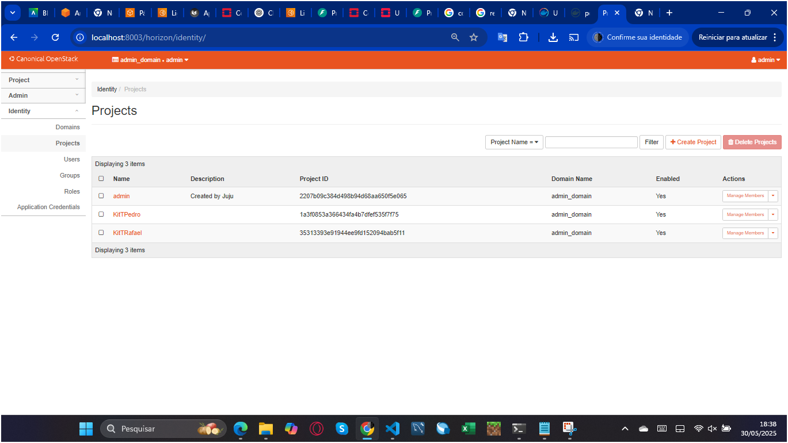
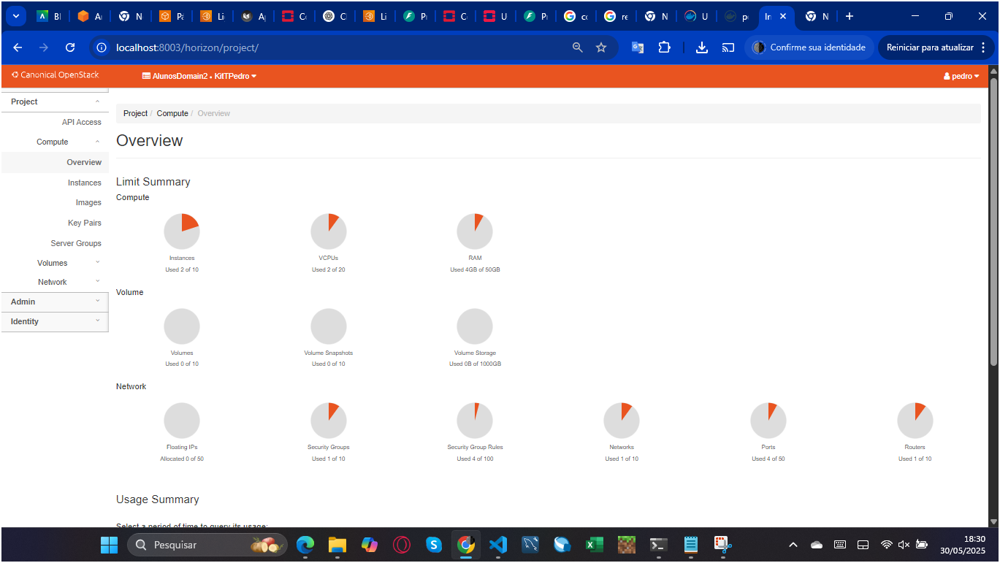
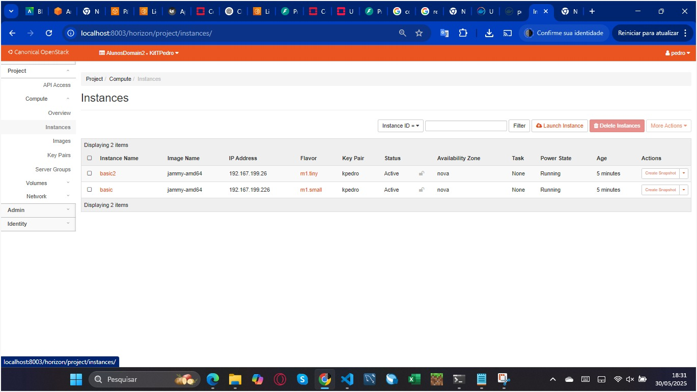
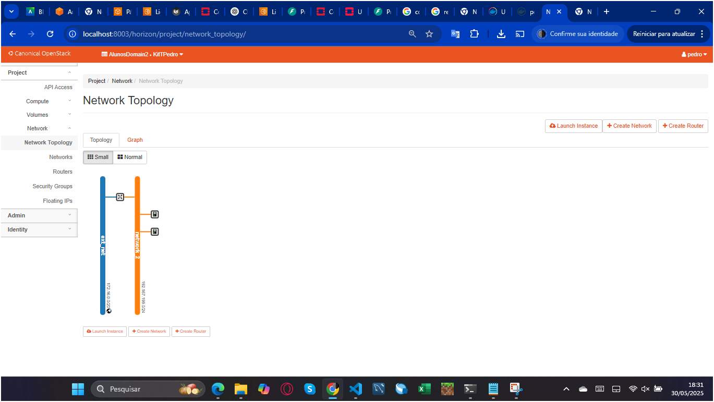
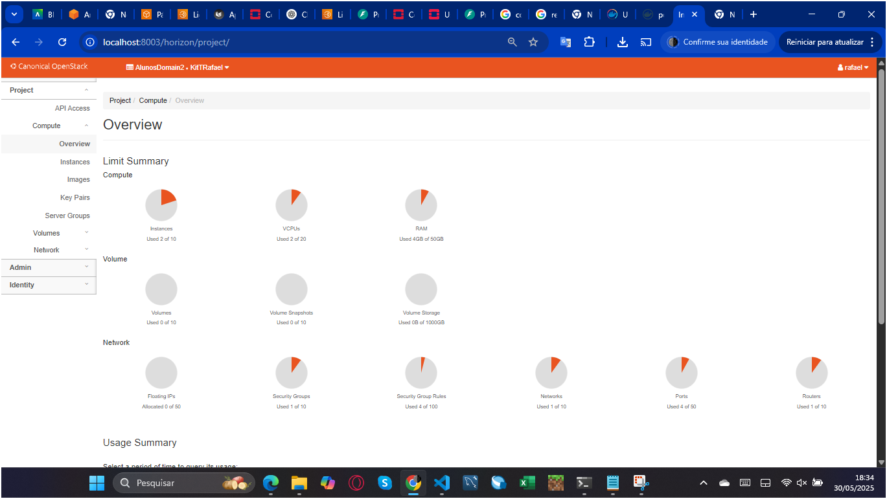

# Roteiro 4 - SLA, DR e IaC

## 1. Objetivo

Este roteiro tem como objetivo:

* Compreender os fundamentos de Infraestrutura como Código (IaC)
* Entender conceitos de SLA (Service Level Agreement) e DR (Disaster Recovery)
* Implementar uma hierarquia de projetos no OpenStack
* Criar infraestrutura via Terraform e implantar aplicações de forma isolada

---

## 2. IaC - Infraestrutura como Código

### 2.1 O que é IaC?

IaC (Infraestrutura como Código) é uma abordagem que permite gerenciar e provisionar ambientes de TI por meio de arquivos de configuração, evitando a configuração manual e promovendo consistência e reprodutibilidade.

Principais benefícios:

* Ambientes consistentes e reprodutíveis
* Automatização de configurações
* Documentação via código
* Controle de versão das mudanças de infraestrutura

### 2.2 Ferramentas: Terraform

O Terraform, da HashiCorp, é uma das ferramentas mais usadas para IaC. Ele permite definir recursos de infraestrutura em arquivos legíveis e gerenciar o ciclo de vida completo do ambiente.

Passos típicos de uso:

```bash
terraform init     # Inicializa os plugins
terraform plan     # Mostra o que será alterado
terraform apply    # Aplica as mudanças
```

### 2.3 Instalação do Terraform no Ubuntu/Debian

```bash
wget -O- https://apt.releases.hashicorp.com/gpg | gpg --dearmor | sudo tee /usr/share/keyrings/hashicorp-archive-keyring.gpg
gpg --no-default-keyring --keyring /usr/share/keyrings/hashicorp-archive-keyring.gpg --fingerprint
echo "deb [signed-by=/usr/share/keyrings/hashicorp-archive-keyring.gpg] https://apt.releases.hashicorp.com $(lsb_release -cs) main" | sudo tee /etc/apt/sources.list.d/hashicorp.list
sudo apt update && sudo apt install terraform
```

---

## 3. OpenStack - Hierarquia de Projetos

### 3.1 Criação de Domínio e Projetos

* Acessando: `Identity > Domains`
* Foi criado o domínio "AlunosDomain2"
* Acessando: `Identity > Projects`
* Criou-se projetos: `KitTRafael` e `KitTPedro`

### 3.2 Criação de Usuários

* Acessando: `Identity > Users`
* Criou-se usuários `rafael` e `pedro`
* Associou-se cada um ao seu projeto
* Atribuiu-se o papel de admin aos usuários

### 3.3 Prints de Validação

**1. Projects**



**2. Users**


**3. Compute Overview**



**4. Compute Instances**



**5. Network Topology**




**1. Projects**


**2. Users**


**3. Compute Overview**



**4. Compute Instances**


**5. Network Topology**


---

## 4. Infraestrutura com Terraform

### 4.1 Estrutura de Pastas

```
/KiTNome/
└── terraform/
    ├── provider.tf
    ├── instance1.tf
    ├── instance2.tf
    ├── network.tf
    └── router.tf
```

### 4.2 Arquivos Terraform

**provider.tf**

```hcl
provider "openstack" {
  region    = "RegionOne"
  user_name = "SEU_USUARIO"
}
```

**instance1.tf**

```hcl
resource "openstack_compute_instance_v2" "instancia" {
  name        = "basic"
  image_name  = "bionic-amd64"
  flavor_name = "m1.small"
  key_pair    = "mykey"
  network {
    name = "network_1"
  }
}
```

**instance2.tf**

```hcl
resource "openstack_compute_instance_v2" "instancia" {
  name        = "basic2"
  image_name  = "jammy-amd64"
  flavor_name = "m1.tiny"
  key_pair    = "mykey"
  network {
    name = "network_1"
  }
}
```

**network.tf**

```hcl
resource "openstack_networking_network_v2" "network_1" {
  name = "network_1"
}

resource "openstack_networking_subnet_v2" "subnet_1" {
  network_id = openstack_networking_network_v2.network_1.id
  cidr       = "192.167.199.0/24"
}
```

**router.tf**

```hcl
resource "openstack_networking_router_v2" "router_1" {
  name                = "my_router"
  external_network_id = "<ID_EXT_NETWORK>"
}

resource "openstack_networking_router_interface_v2" "int_1" {
  router_id = openstack_networking_router_v2.router_1.id
  subnet_id = openstack_networking_subnet_v2.subnet_1.id
}
```

### 4.3 Execução

```bash
source openstack-base/openrc
source arquivo.sh
terraform init
terraform plan
terraform apply
```

---

## 5. SLA e Disaster Recovery

### 5.1 Escolha da Nuvem

**Você escolheria Public Cloud ou Private Cloud? Justifique.**

Optaria por uma **Private Cloud**, pois o sistema é crítico, com dados sigilosos e necessidade de controle sobre segurança e compliance. A Private Cloud oferece maior controle sobre as configurações de rede, políticas de acesso e backups, além de permitir personalização de acordo com as demandas específicas da empresa. Ainda assim, buscaria implementar uma arquitetura híbrida caso haja a necessidade de escalabilidade em momentos de pico.

### 5.2 Justificativa do Time DevOps

O time de DevOps é essencial para garantir a integração contínua, entrega automatizada e monitoramento constante da infraestrutura e aplicações. Eles promovem agilidade, reduzem falhas manuais, aumentam a confiabilidade dos sistemas e permitem rápida recuperação diante de incidentes. Para um sistema crítico, a atuação de DevOps é estratégica, pois permite responder com eficiência a mudanças e falhas operacionais.

### 5.3 Plano de DR e HA

**Ameaças Identificadas:**

* Falha de hardware
* Ataques cibernéticos (ransomware, DDoS)
* Interrupções de energia/rede
* Erros humanos em configurações e deploys

**Ações para recuperação:**

* Configuração de snapshots diários dos volumes
* Scripts de recuperação rápida em Terraform
* Rede redundante com failover automático
* Execução de simulações de desastre regularmente

**Política de Backup:**

* Backups diários criptografados
* Retenção mínima de 30 dias
* Armazenamento redundante (on-premise + nuvem)
* Verificações periódicas de integridade dos backups

**Alta Disponibilidade (HA):**

* Serviços replicados em múltiplos nós
* Load balancer com health check
* Monitoramento 24/7 com alertas
* Auto scaling em caso de picos de uso

> Plano de DR e HA focado em recuperação ágil e mitigação de riscos em sistemas críticos. A implementação deve ser constantemente testada e revisada para manter a resiliência do ambiente.

---

